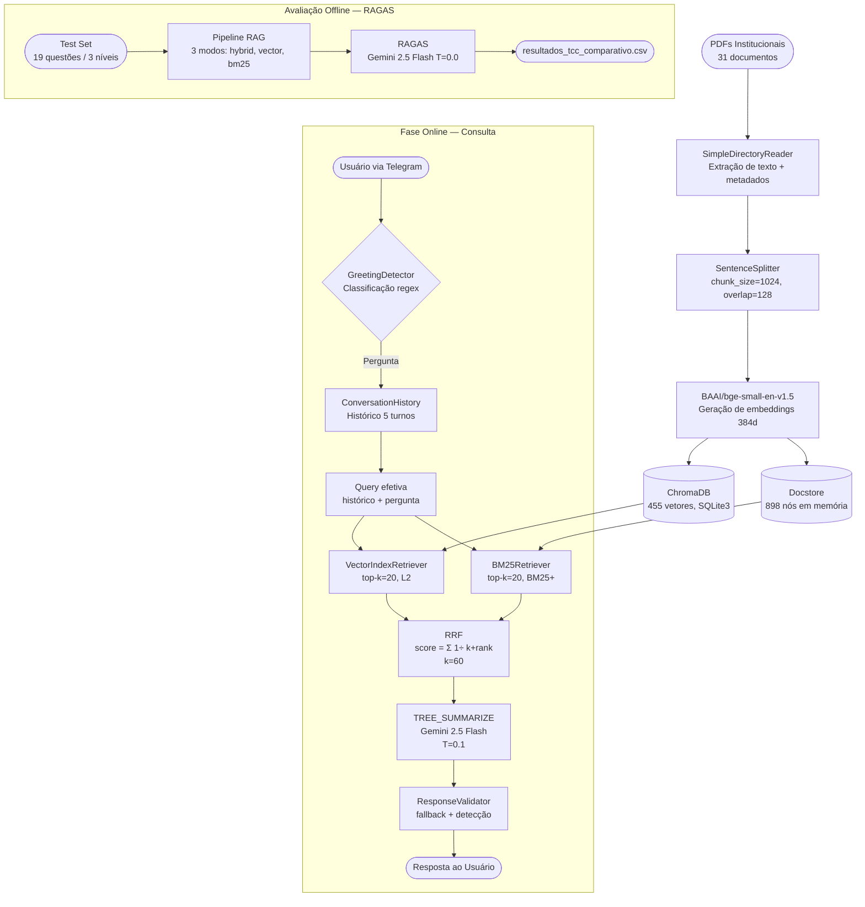

# Metodologia

## 1. Classificação da Pesquisa

O presente trabalho classifica-se, quanto à **natureza**, como pesquisa aplicada, uma vez que objetiva desenvolver uma solução tecnológica para um problema concreto de acesso à informação acadêmica institucional. Quanto à **abordagem**, o estudo é predominantemente quantitativo: a qualidade do sistema é mensurada por meio de métricas numéricas derivadas do framework RAGAS, permitindo comparação objetiva entre configurações distintas de recuperação de informação.

Quanto aos **objetivos**, a pesquisa é de caráter experimental e descritivo: experimental por manipular sistematicamente a estratégia de recuperação (vetorial, lexical e híbrida) e medir o efeito sobre as métricas de avaliação; descritivo por caracterizar o comportamento do sistema sobre um corpus documental de domínio fechado.

Quanto aos **procedimentos técnicos**, enquadra-se como estudo de caso aplicado — o domínio é restrito aos documentos institucionais da Faculdade de Engenharia da Computação e Telecomunicações (FCT) da Universidade Federal do Pará (UFPA) — combinado com pesquisa experimental comparativa entre três arquiteturas de recuperação.

---

## 2. Materiais

### 2.1 Hardware

| Componente | Especificação |
|---|---|
| Processador | Apple M2 (ARM64, 8 núcleos de desempenho + eficiência) |
| Memória RAM | 16 GB Unified Memory (memória compartilhada CPU/GPU/Neural Engine) |
| Ambiente de execução local | macOS (desenvolvimento e avaliação RAGAS) |
| Ambiente de produção | Railway (cloud PaaS, contêiner Docker, CPU x86-64) |

### 2.2 Software, Linguagens e Bibliotecas

**Linguagem de programação:** Python 3.12.12 (ambiente virtual `venv`)

**Tabela de dependências com versões exatas:**

| Biblioteca | Versão | Finalidade |
|---|---|---|
| llama-index-core | 0.14.21 | Orquestração do pipeline RAG |
| llama-index-llms-gemini | 0.6.2 | Integração com a API Gemini |
| llama-index-embeddings-huggingface | 0.7.0 | Geração de embeddings locais |
| llama-index-vector-stores-chroma | 0.5.5 | Conector ChromaDB |
| llama-index-retrievers-bm25 | 0.7.1 | Retriever BM25 |
| bm25s | 0.3.6 | Motor BM25 (variante Lucene) |
| chromadb | 1.5.8 | Banco de dados vetorial (backend SQLite3) |
| sentence-transformers | 5.4.1 | Backbone do modelo de embeddings |
| aiogram | 3.27.0 | Interface assíncrona com a API do Telegram |
| ragas | 0.4.3 | Framework de avaliação do pipeline RAG |
| langchain-google-genai | 4.2.2 | LLM juiz para o RAGAS |
| datasets | 4.8.5 | Estrutura de dados para avaliação RAGAS |
| google-generativeai | 0.8.6 | SDK Google Generative AI |
| python-dotenv | 1.2.2 | Gerenciamento de variáveis de ambiente |

**Modelo de linguagem (LLM) para geração:** Google Gemini 2.5 Flash (`models/gemini-2.5-flash`), acessado via API REST.

**Modelo de linguagem (LLM juiz) para avaliação:** Google Gemini 2.5 Flash (`gemini-2.5-flash`), acessado via LangChain Google GenAI.

**Modelo de embeddings:** `BAAI/bge-small-en-v1.5` — modelo de transformers com 384 dimensões, da família BGE (*Beijing Academy of Artificial Intelligence*), otimizado para recuperação semântica. Apesar do sufixo `-en`, modelos BGE apresentam transferência multilíngue razoável em benchmarks de recuperação para português, e sua compactidade (66 M de parâmetros) foi determinante para execução no ambiente local sem GPU dedicada. Alternativas multilíngues (e.g., `paraphrase-multilingual-MiniLM-L12-v2`) não foram avaliadas de forma sistemática — essa limitação é discutida na Seção 7.

### 2.3 Corpus Documental

O corpus é composto por **31 documentos em formato PDF** de origem institucional, coletados manualmente junto à FCT/UFPA. Os documentos não são públicos em repositório externo — constituem a base de conhecimento de domínio fechado do sistema.

| Categoria | Documentos | Conteúdo |
|---|---|---|
| Ementas — Engenharia da Computação | 8 PDFs | Blocos I a VIII (disciplinas, ementas, bibliografias, cargas horárias) |
| Ementas — Engenharia de Telecomunicações | 10 PDFs | Blocos I a X |
| Regulamentos FCT | 5 PDFs | Normas de TCC, Estágio Supervisionado, Atividades Complementares |
| Documentos institucionais | 8 PDFs | Regimento UFPA, histórico da faculdade, informações gerais |
| **Total** | **31 PDFs** | — |

### 2.4 Ambiente de Desenvolvimento e Execução

O desenvolvimento foi realizado em ambiente local (macOS, Apple M2) com isolamento de dependências via ambiente virtual Python (`venv`). A implantação em produção utiliza contêiner Docker baseado na imagem `python:3.13-slim`, executado na plataforma Railway. O gerenciamento de credenciais é feito exclusivamente por variáveis de ambiente (`TELEGRAM_TOKEN`, `GOOGLE_API_KEY`), nunca por valores literais no código-fonte.

---

## 3. Métodos

### 3.1 Visão Geral do Pipeline

O sistema foi construído segundo o paradigma **RAG** (*Retrieval-Augmented Generation*), que divide o processamento em duas fases distintas: indexação offline dos documentos e recuperação-síntese online por consulta do usuário.

### 3.2 Fase 1 — Indexação dos Documentos (Offline)

Implementada em `scripts/indexar_documentos.py`. Esta fase é executada previamente à operação do bot e seu resultado é persistido em disco.

**Etapa 1 — Leitura dos documentos**
Os 31 arquivos PDF foram carregados com `SimpleDirectoryReader` do LlamaIndex, que extrai o texto bruto de cada página e associa metadados de origem (`file_name`, `page_label`).

**Etapa 2 — Segmentação em chunks**
O texto extraído foi segmentado com `SentenceSplitter`, adotando os parâmetros recomendados pela documentação do LlamaIndex:

| Parâmetro | Valor | Justificativa |
|---|---|---|
| `chunk_size` | 1024 tokens | Equilíbrio entre contexto suficiente por chunk e precisão da recuperação |
| `chunk_overlap` | 128 tokens | Preserva continuidade semântica entre chunks adjacentes |

O processo resultou em **898 nós** armazenados no docstore, oriundos de múltiplas execuções incrementais à medida que novos documentos foram incorporados ao corpus ao longo do desenvolvimento.

**Etapa 3 — Geração de embeddings e persistência vetorial**
Cada chunk foi convertido em vetor denso de 384 dimensões pelo modelo `BAAI/bge-small-en-v1.5`, executado localmente via `sentence-transformers`. Os vetores foram armazenados no ChromaDB (coleção `institucional_db`, backend SQLite3 em `storage/`). O total de vetores persistidos no ChromaDB é de **455**, resultado das execuções de indexação. O docstore (898 nós) acumula todos os chunks gerados nas diferentes execuções incrementais, enquanto o ChromaDB reflete o estado da última indexação persistida.

O LLM não é utilizado nesta fase — apenas o modelo de embeddings local, o que torna a indexação independente de cota de API.

### 3.3 Fase 2 — Recuperação e Geração (Online)

Implementada em `core/engine.py`, `core/retriever.py` e `core/prompts.py`.

#### 3.3.1 Configuração do Motor de Recuperação

O sistema suporta três modos de recuperação, configuráveis via parâmetro `retrieval_mode` de `InstitutionalHybridBot`:

| Modo | Retriever instanciado |
|---|---|
| `"hybrid"` (padrão) | `HybridRetriever` (Vector + BM25 + RRF) |
| `"vector"` | `VectorIndexRetriever` (apenas busca semântica) |
| `"bm25"` | `BM25Retriever` (apenas busca lexical) |

Em todos os modos, o parâmetro `similarity_top_k = 20` define o número de documentos candidatos recuperados por cada sub-retriever.

#### 3.3.2 Busca Vetorial

Utiliza-se `VectorIndexRetriever` sobre o índice ChromaDB. A similaridade entre a query e os chunks é calculada por **distância L2** no espaço vetorial de 384 dimensões (configuração padrão do ChromaDB, conforme metadado `"space":"l2"` da coleção). A query é convertida para vetor pelo mesmo modelo `BAAI/bge-small-en-v1.5` utilizado na indexação.

#### 3.3.3 Busca Lexical — BM25 (Variante Lucene)

Utiliza-se `BM25Retriever` do LlamaIndex sobre os nós do docstore carregados em memória. O motor subjacente é o `bm25s` 0.3.6, que implementa a variante **BM25 Lucene** (também denominada BM25+), com os seguintes hiperparâmetros padrão:

| Parâmetro | Valor | Descrição |
|---|---|---|
| k1 | 1.5 | Saturação de frequência de termos no documento |
| b | 0.75 | Normalização pelo comprimento do documento |
| delta | 0.5 | Fator de piso da variante BM25+ |
| method | `'lucene'` | Variante de normalização IDF estilo Lucene |

A fórmula de pontuação BM25+ para um documento $d$ dado uma consulta $q$ com termos $t_i$ é:

$$\text{score}(d, q) = \sum_{i=1}^{n} \text{IDF}(t_i) \cdot \left( \delta + \frac{f(t_i, d) \cdot (k_1 + 1)}{f(t_i, d) + k_1 \cdot \left(1 - b + b \cdot \frac{|d|}{\text{avgdl}}\right)} \right)$$

onde $f(t_i, d)$ é a frequência do termo $t_i$ no documento $d$, $|d|$ é o comprimento do documento e $\text{avgdl}$ é o comprimento médio do corpus.

A tokenização aplica o padrão regex `(?u)\b\w\w+\b` (tokens com dois ou mais caracteres alfanuméricos), sem stemming. O parâmetro `language` do `BM25Retriever` foi mantido no valor padrão (`'en'`); a configuração com `language='pt'` ou tokenizador personalizado para português não foi avaliada — implicações dessa escolha são discutidas na Seção 7, item 4.

#### 3.3.4 Reciprocal Rank Fusion (RRF)

Implementado em `core/retriever.py`, método `_reciprocal_rank_fusion()`. O RRF combina os dois rankings independentes (vetorial e BM25) sem depender da escala absoluta dos scores de cada retriever — o que é especialmente relevante porque os scores de similaridade L2 e os scores BM25 não são comparáveis diretamente.

A pontuação RRF de um documento $d$ é calculada como:

$$\text{score}_{\text{RRF}}(d) = \sum_{r \in R} \frac{1}{k + \text{rank}_r(d)}$$

onde $R$ é o conjunto de rankings (vetorial e BM25), $\text{rank}_r(d)$ é a posição do documento $d$ no ranking $r$ (indexado a partir de zero) e $k = 60$ é a constante de suavização padrão da literatura (Cormack et al., 2009).

Os documentos são então reordenados em ordem decrescente de $\text{score}_{\text{RRF}}$. Um documento presente em ambos os rankings com posições altas acumula score superior ao de um documento presente em apenas um ranking. O score RRF resultante é armazenado como atributo `score` do objeto `NodeWithScore` retornado, mantendo compatibilidade com a interface do LlamaIndex.

Os scores RRF típicos ficam na faixa de $[0.010, 0.033]$, valores incompatíveis com o `SimilarityPostprocessor` (projetado para cosine similarity em $[0, 1]$). Por essa razão, o postprocessor por cutoff é aplicado **exclusivamente** no modo `"vector"`.

#### 3.3.5 Síntese da Resposta

Os nós recuperados são consolidados em um único bloco de contexto e submetidos ao LLM Gemini 2.5 Flash no modo `TREE_SUMMARIZE` do LlamaIndex. Esse modo é adequado para corpora fragmentados, pois agrupa os chunks em grupos menores, sumariza cada grupo e combina os resultados de forma hierárquica.

O prompt de síntese foi desenvolvido especificamente para o domínio acadêmico e contém cinco regras obrigatórias (`core/engine.py`, método `_create_custom_prompt_template()`):

1. **Foco no positivo** — se a informação constar em qualquer parte do contexto, deve ser relatada, ignorando-se trechos que não a mencionem;
2. **Sem comentários extras** — informações não solicitadas não devem ser adicionadas;
3. **Exaustividade** — todos os itens (disciplinas, cargas horárias) do bloco solicitado devem ser listados;
4. **Fidelidade** — os dados devem ser transcritos conforme aparecem no documento;
5. **Fonte** — o arquivo de origem deve ser citado ao final.

O LLM é configurado com temperatura $T = 0.1$, favorecendo respostas determinísticas.

#### 3.3.6 Gestão do Histórico de Conversa

O sistema mantém um buffer circular de até **5 turnos** (pares pergunta-resposta) por usuário, implementado em `utils/conversation_history.py` com estrutura `dict[int, deque]`. O histórico é serializado como bloco de texto e pré-pendido à query corrente antes de ser enviado ao motor RAG, permitindo a resolução de referências anafóricas em perguntas de acompanhamento.

#### 3.3.7 Validação da Resposta

Após a síntese, a resposta passa por validação em `core/prompts.py` (`ResponseValidator`):

- Remoção de prefixos indesejados (e.g., "RESPOSTA:", "De acordo com os documentos,");
- Rejeição de respostas com menos de 20 caracteres, substituídas por mensagem de fallback;
- Detecção de seis frases indicadoras de incerteza ou alucinação (e.g., "eu acho que", "provavelmente") — quando detectadas, um aviso é registrado em log.

#### 3.3.8 Classificação de Intenção

A mensagem do usuário é classificada por `utils/greeting_detector.py` antes de chegar ao motor RAG. A classificação é feita por correspondência de expressões regulares em dois conjuntos: padrões de saudação (6 expressões) e padrões de pergunta (5 expressões). O resultado determina se o sistema deve responder com mensagem de boas-vindas, processar a query diretamente, ou fazer ambos.

### 3.4 Interface com o Usuário

A comunicação é realizada via API do Telegram, utilizando `aiogram` 3.27.0 no modo **long polling** assíncrono. O bot expõe dois comandos:

- `/start` — apresentação e limpeza do histórico de conversa do usuário;
- `/contexto <query>` — recupera e exibe os nós do contexto sem sintetizar resposta (ferramenta de diagnóstico).

Cada query é processada com timeout de **90 segundos**. Respostas acima de **4000 caracteres** são truncadas por limitação da API do Telegram.

---

## 4. Fluxograma da Metodologia



---

## 5. Procedimentos Experimentais

### 5.1 Construção do Test Set

O conjunto de avaliação foi construído manualmente com **19 questões** distribuídas em três níveis de dificuldade, cobrindo ambos os cursos da FCT:

| Nível | Descrição | Questões |
|---|---|---|
| 1 — Factoides | Perguntas diretas com resposta numérica ou nominal única | 5 |
| 2 — Procedimentais | Perguntas sobre sequências de passos e prazos | 4 |
| 3 — Condicionais | Raciocínio lógico com premissas falsas ou condições compostas | 6 |
| Telecomunicações | Factoides e procedimentais do curso de Telecomunicações | 4 |

Cada questão é acompanhada de uma **referência** (*ground truth*) extraída diretamente dos documentos institucionais, utilizada pelas métricas `ContextPrecision` e `ContextRecall` do RAGAS.

### 5.2 Configurações Experimentais Comparadas

Foram definidas três configurações experimentais, variando exclusivamente a estratégia de recuperação:

| Configuração | Retriever | Postprocessor |
|---|---|---|
| `hybrid` | Vector (top-20) + BM25+ (top-20) + RRF | Nenhum |
| `vector` | VectorIndexRetriever (top-20) | SimilarityPostprocessor (cutoff=0.3) |
| `bm25` | BM25Retriever (top-20) | Nenhum |

O LLM de síntese (Gemini 2.5 Flash, $T=0.1$), o modelo de embeddings e o prompt de síntese são mantidos **idênticos** nas três configurações, garantindo que as diferenças nas métricas sejam atribuídas exclusivamente ao componente de recuperação.

### 5.3 Coleta do Baseline

Um baseline pré-melhorias foi coletado (`resultados_tcc_baseline.csv`, gerado no commit `8fcf688`) para servir como ponto de comparação antes das evoluções arquiteturais. Naquele estado do código, o sistema utilizava uma estratégia de fusão simples por `node_id` (não RRF), sem gestão de histórico de conversa e com o `SimilarityPostprocessor` ativo sobre todos os modos de recuperação. Em outras palavras, o baseline representa o sistema antes das seguintes melhorias implementadas ao longo deste trabalho: (i) fusão por Reciprocal Rank Fusion, (ii) buffer de histórico de conversa e (iii) correção do postprocessor para modos híbrido/BM25.

O baseline contém **15 questões** e **3 métricas** (Faithfulness, AnswerRelevancy, ContextPrecision).

**Resultados do baseline (10 questões válidas — 5 falharam por expiração de chave de API durante a coleta):**

| Métrica | Média (questões válidas) |
|---|---|
| Faithfulness | 1.000 |
| AnswerRelevancy | 0.724 |
| ContextPrecision | 0.247 |

O ContextPrecision baixo (0.247) motivou a implementação do RRF: indica que os documentos relevantes eram recuperados, mas não posicionados nas primeiras posições do ranking, prejudicando a qualidade do contexto entregue ao LLM.

### 5.4 Avaliação Comparativa

A avaliação comparativa é executada via `core/evaluator.py`, comando:

```
python -m core.evaluator
```

O script executa sequencialmente as três configurações sobre o mesmo test set de 19 questões, registra respostas e contextos recuperados, e calcula as quatro métricas RAGAS com o LLM juiz (Gemini 2.5 Flash, $T=0.0$, determinístico). Os resultados são consolidados em `resultados_tcc_comparativo.csv` com coluna `retrieval_mode` para distinção das configurações.

**Resultados comparativos** *(a preencher após execução — `python -m core.evaluator`)*:

| Configuração | Faithfulness | AnswerRelevancy | ContextPrecision | ContextRecall |
|---|---|---|---|---|
| `hybrid` | — | — | — | — |
| `vector` | — | — | — | — |
| `bm25` | — | — | — | — |

> **Hipótese:** espera-se que o modo `hybrid` apresente ContextPrecision superior ao baseline (0.247), uma vez que o RRF reordena os chunks combinando evidências semânticas e lexicais, posicionando os documentos relevantes nas primeiras posições do ranking. O ContextRecall do modo `hybrid` deve superar o modo `vector` puro, pois o BM25 complementa a busca semântica na recuperação de termos técnicos específicos (nomes de disciplinas, siglas, cargas horárias numéricas) que podem não ter boa representação vetorial.

### 5.5 Reprodutibilidade

- O LLM de síntese opera com $T=0.1$ e o LLM juiz com $T=0.0$, minimizando variância entre execuções;
- As dependências são fixadas sem intervalo de versão no `requirements.txt`;
- O índice vetorial (`storage/`) é persistido em repositório, garantindo que as consultas operem sobre o mesmo corpus indexado;
- A execução em contêiner Docker (`python:3.13-slim`) isola o ambiente de produção.

---

## 6. Métricas de Avaliação

As métricas utilizadas pertencem ao framework RAGAS e avaliam dimensões ortogonais da qualidade do pipeline RAG. O LLM juiz (Gemini 2.5 Flash) é empregado para as métricas que requerem raciocínio semântico.

### 6.1 Faithfulness (Fidelidade)

Mede se as afirmações presentes na resposta gerada são sustentadas pelo contexto recuperado, sem introdução de informações externas (alucinação).

$$\text{Faithfulness} = \frac{|\text{afirmações suportadas pelo contexto}|}{|\text{total de afirmações na resposta}|}$$

Valores em $[0, 1]$; quanto mais próximo de 1, menor a taxa de alucinação.

### 6.2 Answer Relevancy (Relevância da Resposta)

Mede o alinhamento semântico entre a resposta gerada e a pergunta original, independentemente da veracidade do conteúdo. Calculada como a média do cosseno entre o embedding da pergunta original e os embeddings de perguntas sintéticas geradas a partir da resposta.

$$\text{AnswerRelevancy} = \frac{1}{N} \sum_{i=1}^{N} \cos(\vec{q}, \vec{q}_i^{\,\text{sintética}})$$

Valores em $[0, 1]$; quanto mais próximo de 1, mais a resposta aborda o que foi perguntado.

### 6.3 Context Precision (Precisão do Contexto)

Mede se os chunks recuperados e posicionados nas primeiras posições do ranking são relevantes para responder à pergunta, dado o *ground truth*. Penaliza rankings que colocam chunks irrelevantes antes dos relevantes.

$$\text{ContextPrecision@k} = \frac{\sum_{k=1}^{K} \left( \text{Precision@k} \times v_k \right)}{\sum_{k=1}^{K} v_k}$$

onde $v_k = 1$ se o $k$-ésimo chunk é relevante e $v_k = 0$ caso contrário.

Valores em $[0, 1]$; diretamente influenciada pela estratégia de reordenação dos chunks (RRF).

### 6.4 Context Recall (Cobertura do Contexto)

Mede se o conjunto de chunks recuperados cobre todas as informações necessárias para responder à pergunta, segundo o *ground truth*.

$$\text{ContextRecall} = \frac{|\text{sentenças do ground truth suportadas pelo contexto}|}{|\text{total de sentenças do ground truth}|}$$

Valores em $[0, 1]$; complementar ao ContextPrecision — enquanto Precision mede a qualidade da ordenação, Recall mede a completude da recuperação.

---

## 7. Limitações Metodológicas

1. **Corpus de domínio fechado:** o sistema foi projetado e avaliado exclusivamente sobre documentos da FCT/UFPA. A generalização para outros domínios ou instituições requereria nova indexação e, possivelmente, ajuste dos parâmetros de chunking e do prompt de síntese.

2. **Test set construído manualmente:** as 19 questões e respectivos *ground truths* foram elaborados pelo próprio desenvolvedor, o que introduz viés de seleção. Um processo de anotação independente por múltiplos avaliadores aumentaria a validade do conjunto de avaliação.

3. **Dependência de API externa:** tanto o LLM de síntese (Gemini 2.5 Flash) quanto o LLM juiz do RAGAS dependem da disponibilidade e das cotas da API Google. Durante a coleta do baseline, 5 das 15 questões falharam por expiração de chave de API, comprometendo parcialmente os resultados.

4. **Tokenização e embeddings em português:** o tokenizador do BM25 foi mantido no idioma padrão (`language='en'`), sem stemming, o que pode reduzir a correspondência de termos morfologicamente relacionados em português. Analogamente, o modelo de embeddings `BAAI/bge-small-en-v1.5`, treinado predominantemente em inglês, foi adotado pela sua compacidade e por apresentar transferência multilíngue razoável em benchmarks de recuperação. Nenhuma das duas alternativas (tokenizador português para BM25 ou modelo multilíngue para embeddings) foi avaliada de forma sistemática, o que constitui uma limitação da presente avaliação.

5. **Divergência entre docstore e ChromaDB:** a indexação incremental ao longo do desenvolvimento resultou em 898 nós no docstore e 455 vetores no ChromaDB. Embora o motor de recuperação opere corretamente (o BM25 utiliza o docstore e a busca vetorial utiliza o ChromaDB de forma independente), a inconsistência entre os dois índices não foi resolvida por reindexação completa antes da coleta dos resultados finais.

6. **Avaliação sem sujeitos humanos:** a qualidade percebida das respostas não foi validada por usuários reais (estudantes da FCT). As métricas RAGAS capturam aspectos técnicos do pipeline, mas não substituem uma avaliação de experiência de uso.

7. **Parâmetros não otimizados por busca sistemática:** os hiperparâmetros `chunk_size`, `chunk_overlap`, `similarity_top_k` e a constante RRF $k=60$ foram adotados a partir de valores de referência da documentação e da literatura, sem busca exaustiva no espaço de hiperparâmetros.

---

## 8. Pendências para a Defesa

| # | Ação | Status |
|---|---|---|
| 1 | Executar `python -m core.evaluator` e preencher a tabela da Seção 5.4 com os resultados `hybrid`, `vector` e `bm25` | ⏳ Pendente |
| 2 | Após preencher a tabela, redigir a análise comparativa: comparar as 4 métricas entre os 3 modos e em relação ao baseline; confirmar ou refutar as hipóteses levantadas na Seção 5.4 | ⏳ Pendente |
